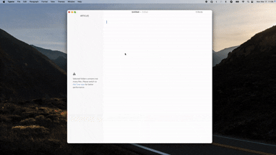
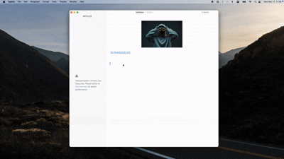

# Y-CLIP

A next-generation **cross-platform clipboard enhancement tool** built on the **Tauri framework**, designed for efficiency!

> Note: Linux support is currently under development as I don't have a Linux device for testing.

  

      English | <a href="./README.zh.md">简体中文</a> 
  

   

  

    <a href="https://github.com/YuanG1944/y-clipboard/releases">
      
    </a >
    <a href="https://github.com/YuanG1944/y-clipboard/releases">
      
    </a >
  

  <a href="./LICENSE">
    
  </a >

## Features

- **Supports All Formats**  
  Plain text | Rich text | HTML | Images | Files
- **Privacy-First Design**  
  Fully local storage | No internet connection | Secure data
- **Smart Favorites**  
  Save frequently used content | Organize with custom categories
- **Lightning-Fast Workflow**  
  Global hotkeys | Mouse-free operation

## Installation

### Windows

Manual download：[x64](https://github.com/YuanG1944/y-clipboard/releases/tag/windows)

### MacOS

Manual download：[Apple Silicon](https://github.com/YuanG1944/y-clipboard/releases/tag/macos)

## How to Use

### Basic Operations

- **`Ctrl/Cmd + Shift + B`**：Open clipboard history

  

- `⬅️ ➡️ Arrow keys`：Select clipboard content / `⬆️ ⬇️ Arrow keys`：Switch paste format

  

- **`Enter`**：Paste the selected content
- **`Backspace`**：Delete the selected content
- **`tab`**: Switch lab
- **`ctrl/cmd + z`**: Undo the delete action
- **`ctrl/cmd + f`**: Focus on search input

- **Save current content to Favorites**

  

- **Search clipboard history**

  

> **First-Time Use Reminder**  
> Please grant clipboard access permission in your system settings:
>
> - macOS: System Preferences → Security & Privacy → Privacy → Accessibility
>
>   
>
> - If you see a “file is damaged” error, run
>   `xattr -c /Applications/y-clip.app`

> **Encountered an issue?**  
> Report it on the [Issues](https://github.com/YuanG1944/y-clipboard/issues)  
> _Please include: OS version, steps to reproduce, and error screenshots._
