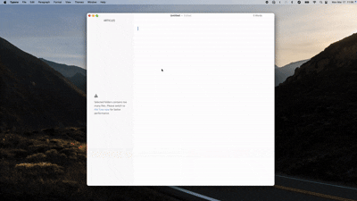
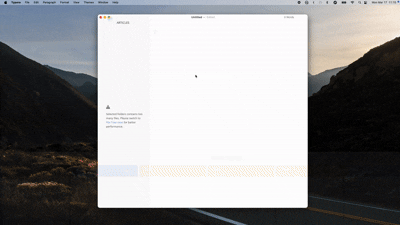
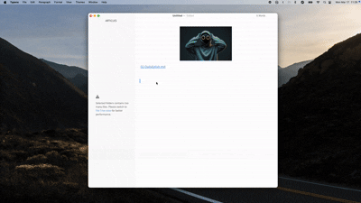
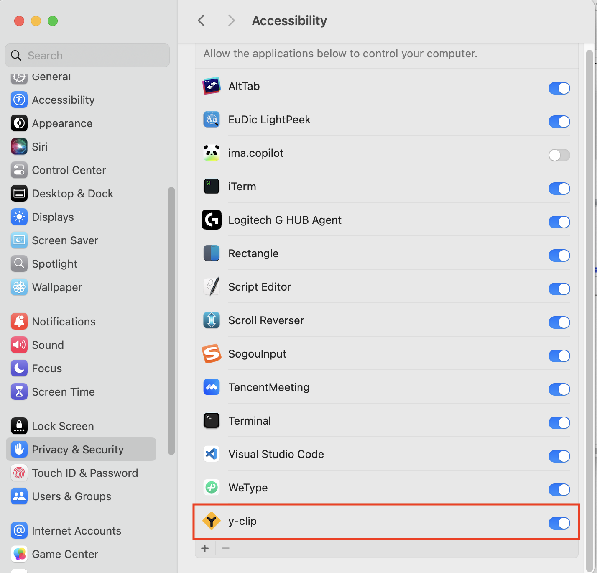

# Y-CLIP

基于**Tauri 框架**构建的新一代跨平台剪切板增强工具，为效率而生！

> 注：由于本人手头没有linux电脑，当前版本暂不支持 Linux系统（开发中）

  

      简体中文 | <a href="./README.md">English</a> 
  

   

  

    <a href="https://github.com/YuanG1944/y-clipboard/releases">
      
    </a >
    <a href="https://github.com/YuanG1944/y-clipboard/releases">
      
    </a >
  

  <a href="./LICENSE">
    
  </a >

## 核心特性

- **全格式支持**  
  纯文本 | 富文本 | HTML | 图片 | 文件
- **隐私至上设计**  
  完全本地存储 | 永不联网 | 数据安全
- **智能收藏夹**  
  收藏高频内容 | 自定义分类管理
- **极速操作流**  
  全局快捷键 | 零鼠标工作流

## 快速安装

### Windows

下载：[x64](https://github.com/YuanG1944/y-clipboard/releases)

### MacOS

下载：[Apple Silicon](https://github.com/YuanG1944/y-clipboard/releases) | [Apple Intel](https://github.com/YuanG1944/y-clipboard/releases)

## 使用指南

### 基础操作

- **`Ctrl/Cmd + Shift + B`**：唤醒剪贴板历史

  

- `⬅️ ➡️ 方向键`：**选择粘贴内容** / `⬆️ ⬇️ 方向键`：**切换粘贴格式**

  

- **`Enter`**：**粘贴选中内容**
- **`Backspace`**：**删除选中内容**
- **`tab`**: **切换标签**
- **`ctrl/cmd + z`**: **撤销删除**
- **`ctrl/cmd + f`**: **聚焦至搜索框**

- **收藏当前内容**

  

- **搜索**

  

> **首次使用提示**  
> 请在系统设置中授予剪贴板访问权限：
>
> - macOS: `系统偏好设置 → 安全性与隐私 → 隐私 → 辅助功能`
>
>   
>
> - 如果遇到“文件已损坏“，请执行
>   `sudo xattr -r -d com.apple.quarantine /Applications/y-clip.app`

> **遇到问题？**  
> 欢迎提交至 [Issues 追踪系统](https://github.com/YuanG1944/y-clipboard/issues)  
> _请附上：系统版本/复现步骤/错误截图_

#### 致谢
>[🔗](https://github.com/tauri-apps/tauri) Tauri
>[🔗](https://github.com/ahkohd/tauri-nspanel) tauri-nspanel 
>[🔗](https://github.com/CrossCopy/tauri-plugin-clipboard) tauri-plugin-clipboard 
>[🔗](https://github.com/ChurchTao/clipboard-rs) clipboard-rs 
>[🔗](https://github.com/EcoPasteHub/EcoPaste) Eco-paste